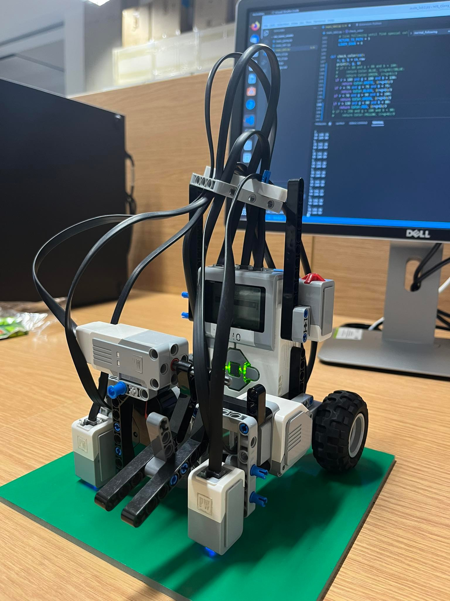
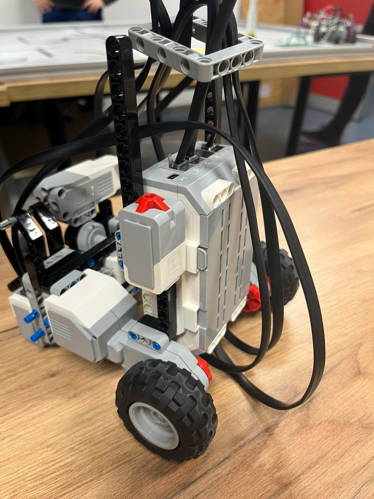
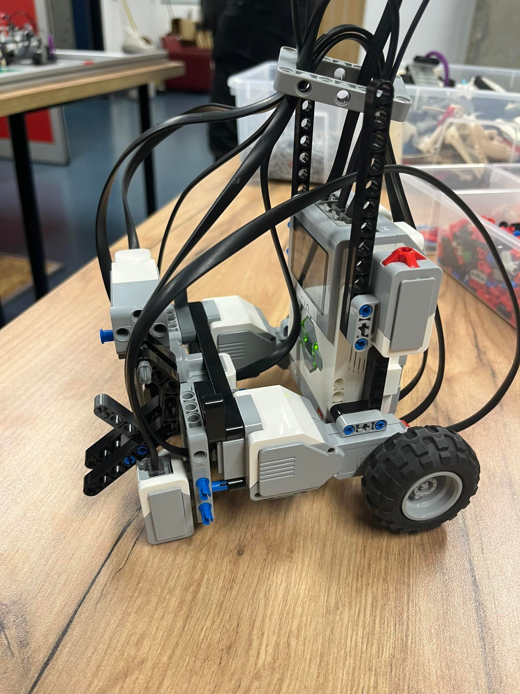

# WR - Project documentation

### The project was done by:
```
Andrii Demydenko - 317084
Truong Giang Do - 317113
```

**Group no. 105** </br>
**Robot name - "1010"** </br>
**Best results - 3m 16s, 2 errors - 24 points** </br>

|  |  |  |
| --- | --- | --- |
|  |  |  | 


## Code:
Import libs
```
from ev3dev2.sensor import INPUT_2, INPUT_1, INPUT_3
from ev3dev2.motor import MediumMotor, OUTPUT_A, OUTPUT_B, SpeedPercent, MoveTank, OUTPUT_D
from ev3dev2.sensor.lego import ColorSensor, InfraredSensor
from ev3dev2.motor import SpeedRPM
from enum import Enum
```
Declare global variables
```
cs2 = ColorSensor(INPUT_2)
cs1 = ColorSensor(INPUT_1)

distance = InfraredSensor(INPUT_3)

tank_drive = MoveTank(OUTPUT_A, OUTPUT_B)

my_motor = MediumMotor(OUTPUT_D)
```
TaskExecution is a core class in our program that includes the status of task execution and the execution algorithms. It is responsible for managing the execution of tasks in the system and provides crucial functionality for changing the task based on current data.
```
class TaskExecution:

    def __init__(self, mission, col_sens_1, col_sens_2, parcel_zone_color, delivery_zone_color, path_to_parcel_color, path_to_delivery_color):
        self.pick_up_status = False
        self.delivery_status = False
        self.current_mission = mission
        self.col_sens_1 = col_sens_1
        self.col_sens_2 = col_sens_2
        self.parcel_zone_color = parcel_zone_color
        self.delivery_zone_color = delivery_zone_color
        self.path_to_parcel_color = path_to_parcel_color
        self.path_to_delivery_color = path_to_delivery_color
        self._tmp_side_flag = None
        self._is_turned = False

    def normal_following(self, param=60):
        _, avg_left = self.col_sens_1
        _, avg_right = self.col_sens_2
        if abs(avg_right - avg_left) <= param:
            tank_drive.on(-10, -10)
        elif avg_right > avg_left:
            tank_drive.on(15, -5)  # Turn left
        else:
            tank_drive.on(-5, 15)  # Turn right

    def correct_picking_position(self, dis):
        tank_drive.on_for_seconds(
            SpeedPercent(-2), SpeedPercent(-2), 1)  # ToDo

    def pick_up(self):
        dis = distance.proximity
        if dis != None and dis <= 10:
            my_motor.on_for_seconds(SpeedRPM(15), 1)
            self.pick_up_status = True
        else:
            self.correct_picking_position(dis)

    def drop_package(self):
        tank_drive.on_for_seconds(SpeedPercent(
            -7), SpeedPercent(-7), 2)
        my_motor.on_for_seconds(SpeedRPM(-15), 1)

        # tank_drive.on_for_seconds(
        #     SpeedPercent(30), SpeedPercent(-30), 1)  # turn back

        # tank_drive.on_for_seconds(
        #     SpeedPercent(-20), SpeedPercent(-20), 1)  # turn back

    def turn_on_side_flag(self):
        if self._is_turned:
            pass
        elif self._tmp_side_flag == Side.RIGHT:
            tank_drive.on_for_seconds(SpeedPercent(
                2), SpeedPercent(-10), 2)
            self._is_turned = True
            print("turn RIGHT for 90")
        elif self._tmp_side_flag == Side.LEFT:
            tank_drive.on_for_seconds(
                SpeedPercent(-10), SpeedPercent(2), 2)
            self._is_turned = True
            print("turn LEFT for 90")

    def return_to_path(self):
        if not self._is_turned:
            tank_drive.on_for_seconds(
                SpeedPercent(-12), SpeedPercent(12), 3)
            tank_drive.on_for_seconds(
                SpeedPercent(12), SpeedPercent(12), 2)
            self._is_turned = True
            print("turn AROUND")

    def set_side_color_depends(self, ccs1, ccs2, color):
        if ccs1 == color:
            self._tmp_side_flag = Side.RIGHT
        else:
            self._tmp_side_flag = Side.LEFT

    def event_check(self):
        ccs1, avg_left = self.col_sens_1
        ccs2, avg_right = self.col_sens_2
        if self.current_mission == Mission.PATH_TO_PARCEL and \
                (ccs1 == self.path_to_parcel_color or ccs2 == self.path_to_parcel_color):
            self.current_mission = Mission.FROM_PATH_TO_PARCEL
            print("FROM_PATH_TO_PARCEL")
            self.set_side_color_depends(ccs1, ccs2, self.path_to_parcel_color)
        elif self.current_mission == Mission.FROM_PATH_TO_PARCEL and \
                (ccs1 == self.parcel_zone_color and ccs2 == self.parcel_zone_color):
            self.current_mission = Mission.PICK_UP
            print("PICK_UP")
            self._is_turned = False
        elif self.current_mission == Mission.PICK_UP and self.pick_up_status == True:
            self.current_mission = Mission.RETURN_TO_PATH
            print("RETURN_TO_PATH")
            self._is_turned = False
        elif self.current_mission == Mission.RETURN_TO_PATH and \
                (avg_left < 60 and avg_right < 60):
            self.current_mission = Mission.DELIVERY
            print("DELIVERY")
            self._is_turned = False
        elif self.current_mission == Mission.DELIVERY and \
                (ccs1 == self.path_to_delivery_color or ccs2 == self.path_to_delivery_color):
            self.delivery_status = True
            self.current_mission = Mission.FROM_PATH_TO_PARCEL
            print("FROM_PATH_TO_DELIVERY")
            self.set_side_color_depends(ccs1, ccs2, self.path_to_parcel_color)
        elif self.delivery_status and self.current_mission == Mission.FROM_PATH_TO_PARCEL and \
                (ccs1 == self.delivery_zone_color and ccs2 == self.delivery_zone_color):
            self.current_mission = Mission.LOWER_DOWN
            print("LOWER_DOWN")

    def update_data(self, col_sens_1, col_sens_2):
        self.col_sens_1 = col_sens_1
        self.col_sens_2 = col_sens_2
        self.event_check()

    def run_events(self):
        if self.current_mission is Mission.PATH_TO_PARCEL:
            self.normal_following(param=60)  # black
        elif self.current_mission is Mission.FROM_PATH_TO_PARCEL:
            self.turn_on_side_flag()
            # ToDo should be param for specific color depends on path_to_parcel_color and for black also
            self.normal_following(param=60)
        elif self.current_mission is Mission.PICK_UP:
            self.pick_up()
        elif self.current_mission is Mission.RETURN_TO_PATH:
            self.return_to_path()
            self.normal_following(param=60)
        elif self.current_mission is Mission.DELIVERY:
            self.turn_on_side_flag()
            self.normal_following(param=60)  # black
        elif self.current_mission is Mission.LOWER_DOWN:
            self.drop_package()
            exit()
```
Three enums classes - a collection of constants such as colors, sides, missions.
```
class Color(Enum):
    RED = 1
    GREEN = 2
    BLUE = 3
    WHITE = 4


class Side(Enum):
    LEFT = 1
    RIGHT = 2


class Mission(Enum):
    PICK_UP = 1  # pick up the parcel with medium motor only
    DELIVERY = 2
    # line following until find spesial color(RED GREEN) with ONE of the sensors
    PATH_TO_PARCEL = 3
    # line following until find spesial color(RED GREEN) with TWO of the sensors
    FROM_PATH_TO_PARCEL = 4
    # line following until find spesial color(RED GREEN)depends which one was first
    RETURN_TO_PATH = 5
    LOWER_DOWN = 6
```
Central functions
```
def check_color(cs):
    r, g, b = cs.raw
    # print(r, g, b)
    if r < 80 and g < 80 and b > 100:
        return Color.BLUE, (r+g+b)/3
    if r > 110 and g < 80 and b < 80:
        return Color.RED, (r+g+b)/3
    if r < 80 and g > 100 and b < 100:
        return Color.GREEN, (r+g+b)/3
    if r > 150 and g > 150 and b > 150:
        return Color.WHITE, (r+g+b)/3
    return None, (r+g+b)/3


def run_loop(tasks: TaskExecution):
    while (True):
        ccs1, rgbcs1 = check_color(cs1)
        ccs2, rgbcs2 = check_color(cs2)
        tasks.update_data((ccs1, rgbcs1), (ccs2, rgbcs2))
        tasks.run_events()
```
Initializing variables based on the current map configuration.
```
def main():
    parcel_zone_color = Color.RED
    delivery_zone_color = Color.GREEN
    path_to_parcel_color = Color.RED
    path_to_delivery_color = Color.GREEN
    tasks = TaskExecution(mission=Mission.PATH_TO_PARCEL,
                          col_sens_1=None, col_sens_2=None,
                          parcel_zone_color=parcel_zone_color,
                          delivery_zone_color=delivery_zone_color,
                          path_to_parcel_color=path_to_parcel_color,
                          path_to_delivery_color=path_to_delivery_color,)
    print("init Tasks")
    run_loop(tasks)


if __name__ == '__main__':
    print("start")
    main()
```


### Description of the calibration procedure and its result (what you get in this process and how you use it)

There is no explicit calibration procedure in the given code. The program initializes sensors and motor connections, sets up initial values for certain variables, and then starts a loop that continuously updates sensor data and executes corresponding tasks based on the current mission and sensor data.

### Detailed description of the line tracking algorithm. Among other things, you should draw a block diagram/finite state machine that describes the operation of the program.

The line tracking algorithm is implemented in the normal_following method in the TaskExecution class. The algorithm compares the average values of the two color sensors, which are positioned on the left and right sides of the robot. If the absolute difference between the average values of the two sensors is within a specified parameter (default is 60), the robot moves forward. If the average value of the right sensor is greater than the left sensor, the robot turns left. If the average value of the left sensor is greater than the right sensor, the robot turns right.

The program operates as a finite state machine with the following states: PATH_TO_PARCEL, FROM_PATH_TO_PARCEL, PICK_UP, RETURN_TO_PATH, DELIVERY, LOWER_DOWN. The main loop checks the current mission, updates the sensor data, and runs corresponding events based on the current state.

### Describe the procedure for selecting the parameters of the line tracking algorithm (I hope that you selected them according to some strategy, if completely by chance then you also need to write it down)

There is no specific procedure for selecting the parameters of the line tracking algorithm provided in the code. The parameter for the normal_following method is set to 60 by default, but it can be adjusted to accommodate different line thicknesses, colors, or sensor sensitivity.

### Block diagram/finite state machine/transporter algorithm activity diagram

The finite state machine can be represented as follows:

PATH_TO_PARCEL: The robot follows the line using the line tracking algorithm.
FROM_PATH_TO_PARCEL: The robot has detected a special color with one of its sensors and now follows the line to the parcel zone.
PICK_UP: The robot picks up the parcel using the medium motor.
RETURN_TO_PATH: The robot returns to the main path and continues following it.
DELIVERY: The robot follows the line to the delivery zone.
LOWER_DOWN: The robot lowers the parcel at the delivery zone and stops.

### Describe the problems you encountered and how to solve them

The main problem is with the color recognition. The color sensors are not very sensitive and can be easily affected by the ambient light. The color recognition algorithm can be improved by using a more sophisticated algorithm to detect the color of the line.

### Conclusions - e.g. what did you learn in the lab.

The given code demonstrates how to create a line following robot using the LEGO MINDSTORMS EV3 platform. It highlights the use of color sensors for line tracking, medium motor for parcel handling, and finite state machine to control the robot's behavior. This lab exercise provides an opportunity to learn about sensor integration, motor control, and robot navigation through the implementation of a line following algorithm and a finite state machine for controlling the robot's various tasks.
